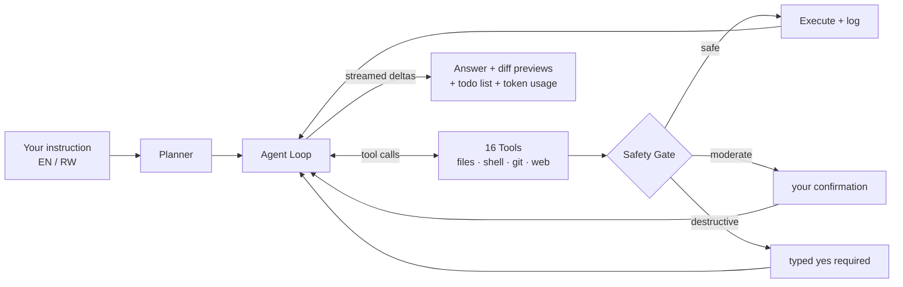

<div align="center">

# Kora

**An open, terminal-based AI coding agent that plans, builds, and ships — in English & Kinyarwanda.**

*Kora* means **"work / do"** in Kinyarwanda.

[](https://www.python.org/)
[](#license)
[](tests/)
[](https://github.com/psf/black)
[](#free-model-providers)

</div>

---

## About

Kora is an AI pair programmer that lives in your terminal. Give it an instruction in plain
language (English *or* Kinyarwanda) and it will plan the work, read and edit your files,
run shell commands, scaffold entire applications, commit to git — all behind a tiered
safety system that never lets a destructive action through without explicit confirmation.

It runs on **100% free models**: local [Ollama](https://ollama.com) (fully offline),
Groq, OpenRouter `:free`, Google Gemini, and NVIDIA NIM — no credit card required.

## How It Works

Kora uses a **ReAct agent loop** (*Reason → Act → Observe*) driven by any supported model:



1. Your instruction is combined with a system prompt and sent to the selected model.
2. The model requests tools (read file, run command, edit, search…); Kora executes them.
3. Every shell command passes the **safety classifier** before running.
4. Results feed back into the loop until the task is done — streamed live into the TUI.
5. File edits always show a **unified diff** and are backed up before applying.

### Built-in Tools

| Category | Tools |
|----------|-------|
| Files | read · write · edit · delete · list directory |
| Code | regex search (ripgrep fast path) · lint diagnostics |
| Shell | command runner with timeouts & output caps |
| Git | status · diff · add · commit |
| Web | web search · URL fetch |
| Workflow | todo list · ask user · project scaffolding |
| Meta | self-update (guarded) |

## Features

- **Full-screen TUI** ([Textual](https://textual.textualize.io)) — project file tree,
  streaming markdown chat, live tool log, status bar (model / branch / tokens / language).
- **Model switching on the fly** — `Ctrl+M` opens a picker across every free provider;
  your choice persists between sessions.
- **Live catalogs** — NVIDIA's full model list is fetched automatically, so new releases
  appear without touching config.
- **Universal tool calling** — models without native function-calling work through a
  robust `<tool_call>{json}</tool_call>` text parser.
- **Safe editing pipeline** — timestamped backups in `~/.kora/backups`, atomic writes,
  automatic restore on syntax-breaking edits.
- **Self-modification mode** — Kora can patch its own source, then run `ruff` + `pytest`
  and roll back automatically if anything fails.
- **Bilingual EN/RW** — auto language detection, translated UI commands, and answers in
  your language.

## Quick Start

**Prerequisites:** Python **3.11+**, and optionally [Ollama](https://ollama.com/download)
for offline local models.

```bash
git clone https://github.com/kora-ai/kora && cd koraAI
pip install -e ".[dev]"
```

Configure API keys by copying `.env.example` → `.env` (Ollama needs nothing):

```env
GROQ_API_KEY=            # https://console.groq.com/keys
OPENROUTER_API_KEY=      # https://openrouter.ai/keys
GEMINI_API_KEY=          # https://aistudio.google.com/apikey
NVIDIA_API_KEY=          # https://build.nvidia.com/settings/api-keys
OLLAMA_BASE_URL=http://localhost:11434
```

Run it:

```bash
kora chat                      # launch the TUI in the current directory
kora chat -p groq              # start with a specific provider
kora run "explain this repo"   # one-shot headless run
kora models                    # list every configured free model
```

For fully-offline usage:

```bash
ollama pull qwen2.5-coder:7b
kora chat                      # default provider is Ollama
```

## Free Model Providers

| Provider | Key needed | Highlights | Example models |
|----------|------------|------------|----------------|
| **Ollama** *(local)* | None — offline | Private, zero cost | `qwen2.5-coder:7b`, `llama3.1:8b` |
| **Groq** | `GROQ_API_KEY` | Extremely fast inference | `llama-3.3-70b-versatile` |
| **OpenRouter** | `OPENROUTER_API_KEY` | Many `:free` models | `deepseek/deepseek-chat-v3-0324:free` |
| **Gemini** | `GEMINI_API_KEY` | 1M-token context | `gemini-3.7-flash`, `gemini-3.6-flash` |
| **NVIDIA NIM** | `NVIDIA_API_KEY` | 70+ models, live catalog | `deepseek-v4-flash`, `gpt-oss-120b`, `kimi-k2.6` |

The catalog lives in [`config/models.yaml`](config/models.yaml) — add or edit entries freely.
Provider marked `dynamic_models: true` (NVIDIA) merges its pinned entries with the provider's
live `/models` endpoint at startup.

## Using the TUI

| Shortcut | Action |
|----------|--------|
| `Ctrl+M` | Model selector (all providers) |
| `Ctrl+T` | Toggle tool log panel |
| `Ctrl+C` | Cancel the running task |
| `Ctrl+D` | Quit |

Slash commands (with Kinyarwanda aliases):

| Command | Alias (RW) | Action |
|---------|-----------|--------|
| `/help` | `/fasha` | Show help |
| `/model [provider] [id]` | `/moderi` | Switch model |
| `/tools` | `/ibikoresho` | List tools |
| `/lang en\|rw\|auto` | — | UI + response language |
| `/self on\|off` | — | Self-modification mode |
| `/clear` | — | Reset conversation |
| `/quit` | `/sohoka` | Exit |

Example instructions:

```text
> Create a FastAPI endpoint that returns user statistics, then write tests for it.
> Refactor auth.py to use dependency injection and run the test suite.
> Kora porogaramu ya Expo y'amabanki y'imikino, iyikorere neza.
```

## Safety Model

Every shell command is classified before execution:

| Tier | Examples | Behavior |
|------|----------|----------|
| **safe** | `ls`, `git status`, `grep` | Auto-runs, logged |
| **moderate** | `npm install`, `pytest`, `git commit` | Needs one `y` |
| **destructive** | `rm -rf`, `git reset --hard`, `sudo`, `DROP` | Requires typed `yes` |

Additional guard rails:

- Commands confined to the project root (opt-out flag exists, off by default)
- Configurable timeout (default 120 s) and output caps
- Hard-block list for fork bombs, raw disk writes, etc.
- File edits previewed as diffs, backed up, and restorable

### Self-Modification Flow

```text
snapshot (git checkpoint) → apply own patch → ruff check → pytest
   PASS → keep changes + log to ~/.kora/self_history.log
   FAIL → automatic rollback (git reset --hard + file backups) + error report
```

Safety-critical modules (command classifier, shell tool, backup logic, agent loop) always
require explicit typed confirmation even in self-modification mode.

## Scaffolding

Ask naturally ("scaffold a FastAPI service called shop-api") or call
`scaffold_project(project_type, name)` directly:

| Type | Stack generated |
|------|-----------------|
| `fastapi` | FastAPI + SQLModel + Pydantic v2 settings + REST CRUD + pytest |
| `react` | Vite + React + TypeScript + Tailwind CSS + typed API client |
| `nextjs` | Next.js App Router + TypeScript + Tailwind |
| `expo` | React Native/Expo + navigation + screens + typed API client |
| `flutter` | Flutter + Material 3 + widget test |

Mobile targets can delegate to official CLIs (`npx create-expo-app`, `flutter create`)
via `options: {"use_cli": true}` when installed.

## Configuration

User-level overrides live in `~/.config/kora/config.yaml` (created on demand):

```yaml
default_provider: ollama       # ollama | groq | openrouter | gemini | nvidia
default_model: qwen2.5-coder:7b
language: auto                 # auto | en | rw
safety_level: normal           # normal | cautious | yolo
confirm_edits: true            # show diffs before applying edits
self_modification: false
allow_outside_root: false
command_timeout: 120           # seconds
max_iterations: 40             # per instruction
```

## Project Layout

```text
src/kora/
├── agent/        ReAct loop, planner, system prompts
├── models/       provider adapters (OpenAI-compat + Gemini), registry, tool-call parser
├── tools/        agent tools + safety-aware shell execution
├── safety/       command risk classifier
├── ui/           Textual TUI (app.py, app.tcss)
├── utils/        atomic writes, backups, diffs, ignore patterns
└── i18n.py       EN/RW translations
config/           models.yaml — the editable free-model catalog
tests/            pytest suite (124 tests)
```

## Development

```bash
pip install -e ".[dev]"
pytest             # run the test suite
ruff check src     # lint
black src          # format
```

Contributions are welcome — open an issue or pull request.

## License

Released under the **MIT License**.

---

<div align="center">

## Author

### Niyonshuti Isaac

Creator & Maintainer of Kora

[](https://niyonshutiisaac.vercel.app)
[](tel:+2500795756597)

</div>
